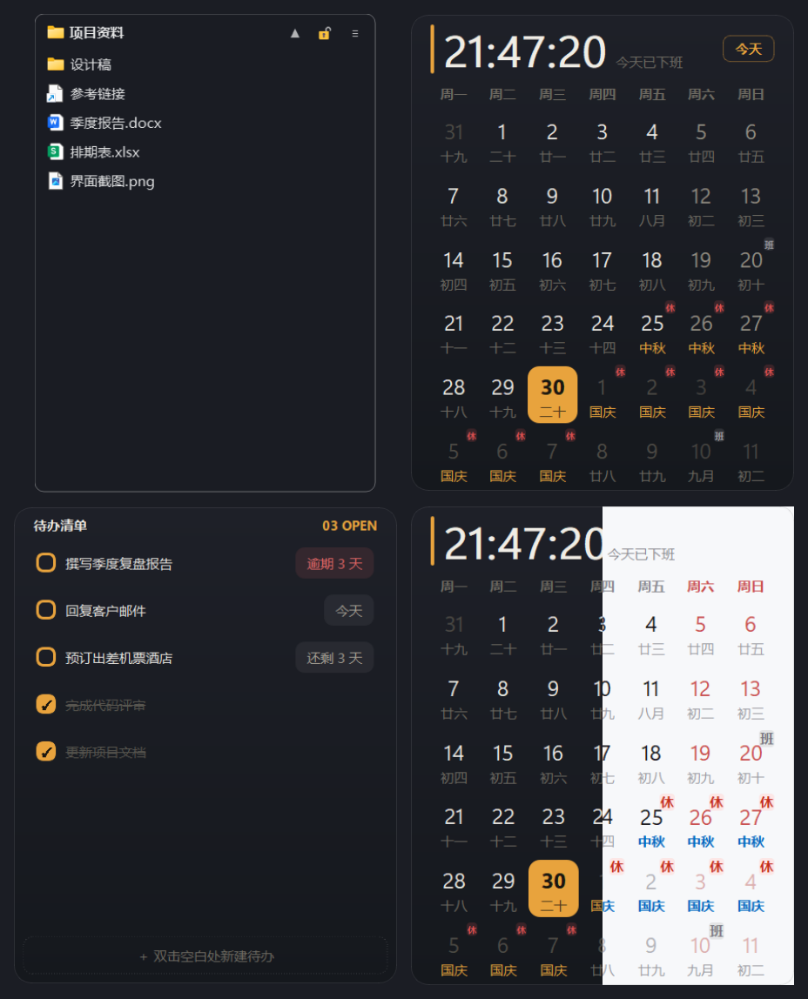

  

# Zviber 桌面格子

Windows 桌面整理格子工具：把堆在桌面的文件拖进格子即归类，附带日历 + 待办悬浮小面板。Win7 / Win10 / Win11 通用。

## 功能

**桌面整理格子**（核心）：

- **空白格子**：拖入即归类——文件**留在桌面原路径不动**（右键「属性」里的位置就是桌面），只是把桌面上的图标收起来、显示在格子里；关闭程序 / 解散格子 / 隐藏格子时图标自动回到桌面，绝不吞文件
- **文件夹映射格子**：实时映射任意已有目录，点左上角图标直达所在文件夹
- 格子可拖动 / 缩放 / 收起 / 锁定，双击标题原地重命名；文件右键弹出与资源管理器逐项一致的系统右键菜单（独立原生宿主进程实现，含 Defender 扫描等扩展项）
- 磨砂半透明贴桌面、免疫 Win+D；双击桌面空白处显隐全部格子与面板

**悬浮面板**（附带）：

- **日历**：顶部时钟 + 三档倒计时（距午休 / 距上班 / 距下班）；周一起始月视图，法定节假日「休」/ 调休「班」角标、农历与节日副标题；滚轮平移翻月
- **待办**：双击空白新建，勾选完成置灰沉底；截止日期 tag（逾期标红 / 今天 / 还剩 N 天）；长文本自动折行
- **主题切换**：深色 / 浅色 / 跟随系统三档，设置窗口一键切换，自动记忆

## 快速开始

到 [Releases](https://github.com/evachxji/zviber/releases) 下载 `ZviberPanel-Setup-v<版本>-x64.exe`，双击打开安装向导即可（仅当前用户安装免管理员）。

源码运行：双击 `run.cmd`（缺 PyQt5 会提示自动安装）。

## exe 安装包（自行构建）

双击 `build.cmd`（或 `python build.py`），产物为单个安装包 `dist\ZviberPanel-Setup-v<版本>-<架构>.exe`（架构跟随打包用的 Python，如 x64）：双击即安装向导，安装范围、安装位置、桌面右键菜单、开机自启均可选；安装出来是 onedir 目录（exe + 一堆依赖文件），常驻启动免解压更快；卸载走 Windows「设置 → 应用」列表，弹出与安装同风格的卸载向导（带进度）：默认保留用户数据（`%APPDATA%\ZviberPanel\`，重装后自动恢复），勾选「同时删除个人数据」则连同待办、格子与配置一并删除。

完整右键菜单（含 Defender 扫描等扩展项）依赖 `native\zshell_host.exe`，已随仓库提交；改动 `native\zshell.cpp` 后需先跑 `native\build_native.cmd` 重新编译（需 MSVC Build Tools）。

## 兼容性

PyQt5（Qt 5.15），Win7 / Win10 / Win11 通用；Win7 需 Python 3.8 + `PyQt5==5.15.*`。

## License

[MIT](LICENSE)
