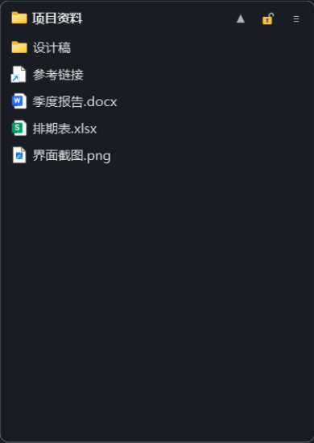
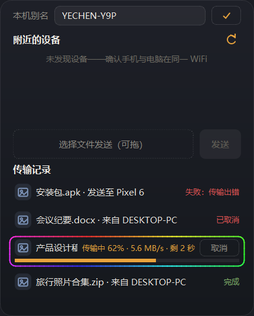

  

# Zbox 桌面格子 v0.4

Windows 桌面整理工具：桌面格子 + 悬浮面板（日历 / 待办 / 传输 / 视频解析）+ 截图。Win10 / Win11。

## 功能

<table>
  <tr>
    <td align="center"> <b>桌面格子</b></td>
    <td align="center"> <b>文件传输</b></td>
    <td align="center"> <b>视频解析</b></td>
  </tr>
</table>

1. **桌面整理**：文件拖入格子即归类，图标自动收纳还原
2. **悬浮面板**：
   - **日历**：时钟倒计时、节假日农历、滚轮翻月
   - **待办**：勾选完成置灰，截止日期逾期提醒
   - **传输**：局域网设备互传文件，手动确认接收
   - **视频解析**：粘贴网址下载视频，多清晰度、断点续传
3. **截图**：全局热键框选标注，支持钉图与滚动长图

## 快速开始

到 [Releases](https://github.com/evachxji/zbox/releases) 下载 `zbox-Setup-v<版本>-x64.exe`，双击打开安装向导即可（仅当前用户安装免管理员）。

源码运行：双击 `run.cmd`（缺 PySide6 会提示自动安装）。

## 自行构建

- 一键三端：双击 `build.cmd`，启动后选 1-7 构建单端或组合（默认 7 全量：Windows exe 安装包 + Android APK + 鸿蒙 HAP），产物汇总在 `dist\release\`（文件名带版本号）
  - 依赖：PC 需 PySide6 + PyInstaller（缺了会提示自动装）；Android 需 JDK 17 与 Android SDK；鸿蒙需 DevEco Studio 与 `devecocli`（`npm i -g @deveco/deveco-cli@stable`）
  - hap 是免签名调试包，只能装模拟器/开发者调试设备；分发真机需签名或上架（见 `harmony\README.md`）

## 兼容性

PySide6（Qt 6.8 LTS），Python 3.10+，Win10 / Win11。

## 开源致谢

局域网传输功能参照开源项目 [LocalSend](https://github.com/localsend/localsend)（Apache License 2.0）的
v2 协议实现，为私有实例（端口 53327 / 组播 224.0.0.168），与官方 LocalSend 应用不互通。
视频解析功能由 [yt-dlp](https://github.com/yt-dlp/yt-dlp) 驱动，音视频合并由 [ffmpeg](https://ffmpeg.org/) 完成。

## License

[MIT](LICENSE)